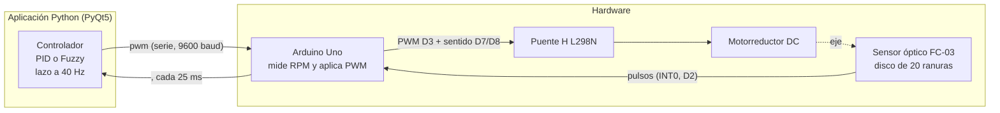

# Simulador y controlador PID / Fuzzy para un motor DC

Aplicación de escritorio en Python que simula un lazo de control PID de un motor de corriente continua y, además, gobierna un motor DC real (Arduino Uno + puente H L298N + sensor óptico de ranuras) con dos controladores intercambiables en caliente: un PID y un controlador difuso (Fuzzy) tipo Mamdani. La vista del controlador difuso muestra paso a paso la fuzzificación, la base de reglas, la inferencia, la agregación y la defuzzificación.

Proyecto de la asignatura Control Inteligente (octavo semestre), Programa de Ingeniería Mecatrónica, Universidad Tecnológica de Bolívar.

- Autor: Carlos Andrés Batista Figueroa (T00078355)
- Docente: Ing. Ph.D. Efraín Rodríguez
- Lugar y fecha: Cartagena de Indias, Colombia, septiembre–octubre de 2026

> Estado del controlador difuso: se verificó en simulación y se ensayó con el motor real a una consigna de 30 rpm, con y sin carga. No está sintonizado de forma exhaustiva sobre el motor real.

---

## Contenido

- Qué incluye
- Arquitectura del sistema
- Estructura del repositorio
- Hardware
- Instalación y ejecución
- Cómo se usa
- Controlador PID
- Controlador difuso (Fuzzy)
- Protocolo serie
- Resultados
- Limitaciones conocidas
- Trabajo futuro
- Documentación e informe
- Referencias principales

---

## Qué incluye

La aplicación central (`Simulador_motor/simulador.py`) tiene tres vistas seleccionables desde la cabecera:

- Control PID: simulación del lazo cerrado con diagrama de bloques, error, salida del controlador y salida del proceso.
- Dinámica del Motor: diagrama del circuito de armadura, ecuaciones del modelo, gráficas de corriente y velocidad.
- Control de Motor Físico: conexión serial con Arduino para controlar un motor real, monitor de RPM y PWM, y comparación entre PID y Fuzzy.

Características destacadas:

- Simulación de la planta con el modelo de motor DC controlado por armadura, integrado con Runge-Kutta de 4.º orden.
- PID paralelo con anti-windup por integración condicional y derivada sobre la medición.
- Control del motor real con el lazo cerrado en el PC a 40 Hz.
- Controlador difuso Mamdani desde cero usando numpy, con 2 entradas, 5 conjuntos por entrada, 6 conjuntos de salida, 25 reglas y defuzzificación por centroide.
- Cambio de controlador en caliente y sin salto (PID ↔ Fuzzy) con el motor en marcha.
- Visualización didáctica del difuso: triángulos, tabla de reglas, conjuntos recortados, agregación y superficie de control.
- Interfaz fluida de un solo hilo con `QPainter` y trazado de curvas sin OpenGL.
- Seguridad: el motor se detiene al desconectar, cerrar la ventana o perder comunicación.

## Arquitectura del sistema



El diseño separa la medición y actuación (Arduino) del cálculo del control (PC). Eso permite cambiar de controlador, ganancias, escala o límites sin recargar el firmware, y la placa no necesita saber si el cálculo lo hace PID o Fuzzy.

## Estructura del repositorio

```text
.
├── README.md
├── Control_fuzzy.pdf                  Informe (artículo) del controlador difuso
├── Simulador_motor/                  Aplicación de escritorio en Python
│   ├── simulador.py                  Simulador + control del motor real (PID y Fuzzy)
│   ├── requirements.txt              Dependencias (PyQt5, pyqtgraph, numpy)
│   ├── ejecutar.bat                  Lanzador para Windows
│   └── documentacion_simulador.md    Documentación técnica completa del simulador
└── Motor_encoder/
    └── motor_encoder/                Firmware del Arduino (proyecto PlatformIO)
        ├── platformio.ini
        ├── src/main.cpp              Sketch: sensor de velocidad + actuador PWM
        └── documentacion_codigo_PID.md Historia del desarrollo del firmware
```

## Hardware

Para la parte física se usa un motorreductor DC tipo TT (reducción 1:48, 3–6 V) con un disco encoder de 20 ranuras en el eje de salida, alimentado por dos baterías 18650 y un convertidor reductor LM2596.

| Componente | Función |
|---|---|
| Arduino Uno (ATmega328P, 16 MHz) | Mide la velocidad y aplica el PWM |
| Puente H L298N | Etapa de potencia y sentido de giro |
| Sensor óptico de ranura FC-03 (comparador LM393) | Pulsos del encoder |
| Motorreductor DC con disco de 20 ranuras | Planta |
| 2 × 18650 + LM2596 | Alimentación |
| Condensador cerámico de 100 nF y electrolítico de 1 µF | Reducción de ruido |

### Conexiones

| Origen | Destino | Función |
|---|---|---|
| L298N `ENA` | Arduino `D3` | PWM (~490 Hz, Timer2) |
| L298N `IN1` | Arduino `D7` | Sentido de giro |
| L298N `IN2` | Arduino `D8` | Sentido de giro |
| FC-03 `D0` | Arduino `D2` (INT0) | Pulsos del encoder |
| FC-03 `VCC` / `GND` | `5V` / `GND` | Alimentación del sensor |
| Motor | L298N `OUT1` / `OUT2` | Canal A del puente |

## Instalación y ejecución

### Simulador (Python)

Requisitos: Windows con Python 3, PyQt5, pyqtgraph y numpy.

```bat
cd Simulador_motor
ejecutar.bat
```

O manualmente:

```bat
cd Simulador_motor
py -m venv .venv
.venv\Scripts\python -m pip install -r requirements.txt
.venv\Scripts\python simulador.py
```

### Firmware (PlatformIO)

1. Abre la carpeta `Motor_encoder/motor_encoder` en VS Code con PlatformIO.
2. Compila y carga el sketch en el Arduino Uno.
3. Ajusta `upload_port` y `monitor_port` si es necesario.

## Cómo se usa

### Simulación

1. Elige la vista Control PID o Dinámica del Motor.
2. Ajusta la planta, la referencia (escalón, onda cuadrada o senoidal) y las ganancias.
3. Pulsa Iniciar simulación.

### Motor físico

1. Cierra cualquier monitor serie abierto.
2. En Control de Motor Físico, elige el puerto COM y pulsa Conectar.
3. Selecciona Control PID o Control Fuzzy.
4. Ajusta el setpoint o un PWM fijo.
5. Ajusta ganancias o rangos del difuso y la escala del sistema.

## Controlador PID

En el motor real, el PID reproduce el esquema que antes corría en el firmware, pero ahora en la aplicación. Con cada medida:

- `e = |SP| - rpm`
- `ff = pwmMin + |SP| * (100 - pwmMin) / rpmMax`
- `u = ff + P + I + D`

Las ganancias son adimensionales y se usan en porcentaje de PWM por porcentaje de fondo de escala. La prealimentación y anti-windup mejoran la respuesta del sistema y evitan que el integrador se sature sin necesidad.

## Controlador difuso (Fuzzy)

### Diseño

Controlador Mamdani de posición que calcula directamente la potencia absoluta (PWM). Las entradas son:

- error `e = |SP| - rpm`
- error acumulado `∫e = sum(e * Ts)`

Se usan cinco conjuntos por entrada y seis por salida. La inferencia se hace por mínimo, la agregación por máximo y la defuzzificación por centroide. La base de reglas es 5×5, con lógica de actuación suave cerca del origen y reacción fuerte lejos de la consigna.

### Vista del controlador difuso

Al elegir Control Fuzzy, la vista sigue el orden del cálculo:

1. Respuesta del motor y fuzzificación.
2. Base de reglas, inferencia y defuzzificación.
3. Superficie de control y motor 3D.
4. Estado del lazo y monitor serie.

## Protocolo serie

9600 baudios, 8N1, cada orden terminada en salto de línea.

| Sentido | Mensaje | Descripción |
|---|---|---|
| Arduino → PC | `<rpm>,<pwm>` | Cada 25 ms: velocidad medida (magnitud) y PWM aplicado |
| PC → Arduino | `pwm <v>` | PWM de −100 a 100 |
| PC → Arduino | `s` | Detener el motor |
| PC → Arduino | `r <v>` | Ranuras por vuelta del disco |
| Arduino → PC | `ERR ...` | Respuesta ante una orden inválida |

## Resultados

Se obtuvieron resultados tanto en simulación como con el motor real. El difuso mostró una respuesta rápida y estable con una consigna de 30 rpm, con y sin carga. En simulación, el controlador difuso obtuvo un sobreimpulso ligeramente menor que el PID en varios tramos de referencia, manteniendo buena precisión y robustez.

## Limitaciones conocidas

- Potencia mínima de la fila Z (20 %): por debajo de ciertas consignas la estabilización puede quedar algo por encima del valor pedido.
- Resolución del encoder: con 20 ranuras hay poca resolución a baja velocidad.
- Dependencia del PC: el USB y el planificador de Windows introducen retardo variable.
- Sin vigilancia en la placa: si la aplicación se bloquea, la placa conserva el último PWM.
- Parámetros no medidos: la constante de tiempo mecánica y la velocidad máxima exacta son estimaciones.
- Un solo canal en el sensor: no se detecta el sentido de giro; se regula la magnitud.

## Trabajo futuro

- Medir la constante de tiempo real y actualizar el modelo equivalente.
- Sintonizar los rangos difusos con el motor real.
- Añadir métricas automáticas de sobreimpulso y tiempo de establecimiento.
- Permitir editar la base de reglas desde la interfaz.
- Mejorar hardware: encoder de cuadratura o puente con menor caída de tensión.

## Documentación e informe

| Documento | Contenido |
|---|---|
| [`Control_fuzzy.pdf`](Control_fuzzy.pdf) | Artículo: Diseño e implementación de un controlador difuso tipo Mamdani para la velocidad de un motor de corriente continua |
| [`Simulador_motor/documentacion_simulador.md`](Simulador_motor/documentacion_simulador.md) | Documentación técnica completa del simulador |
| [`Motor_encoder/motor_encoder/documentacion_codigo_PID.md`](Motor_encoder/motor_encoder/documentacion_codigo_PID.md) | Historia del desarrollo del firmware |

## Referencias principales

- Zadeh, L. A. (1965). Fuzzy sets. Information and Control.
- Mamdani, E. H., y Assilian, S. (1975). An experiment in linguistic synthesis with a fuzzy logic controller. International Journal of Man-Machine Studies.
- Lee, C. C. (1990). Fuzzy logic in control systems: Fuzzy logic controller, Parts I y II. IEEE Trans. SMC.
- Mann, G. K. I., Hu, B.-G., y Gosine, R. G. (1999). Analysis of direct action fuzzy PID controller structures. IEEE Trans. SMC-B.
- Petrescu, I. et al. (2026). A comparative study of PID and bio-inspired fuzzy controllers for speed regulation of low-cost geared DC motors. Biomimetics.
- Ridzuan, A., y Abdul Rahman, H. (2024). Real time comparison between PID and fuzzy logic controller for DC motor speed control. Evolution in Electrical and Electronic Engineering.
- Usoro, I. H., Itaketo, U. T., y Umoren, M. A. (2017). Control of a DC motor using fuzzy logic control algorithm. Nigerian Journal of Technology.

La bibliografía completa está en [`Control_fuzzy.pdf`](Control_fuzzy.pdf).
