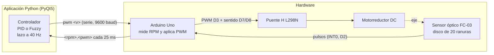

# Simulador y controlador PID / Fuzzy para un motor DC

Aplicación de escritorio en Python que **simula un lazo de control PID de un motor de corriente continua** y, además, **gobierna un motor DC real** (Arduino Uno + puente H L298N + sensor óptico de ranura) con dos controladores intercambiables en caliente: un **PID** y un **controlador difuso (Fuzzy) tipo Mamdani**. La vista del controlador difuso muestra paso a paso cómo funciona: fuzzificación, base de reglas, inferencia, agregación y defuzzificación.

Proyecto de la asignatura **Control Inteligente** (octavo semestre), Programa de Ingeniería Mecatrónica, Universidad Tecnológica de Bolívar.

- **Autor:** Carlos Andrés Batista Figueroa (T00078355)
- **Docente:** Ing. Ph.D. Efraín Rodríguez
- **Lugar y fecha:** Cartagena de Indias, Colombia, septiembre–octubre de 2026

> **Estado del controlador difuso:** se verificó en simulación y se ensayó con el motor real a una consigna de 30 rpm, con y sin carga (ver [Resultados](#resultados)). No está sintonizado de forma exhaustiva sobre el motor.

---

## Contenido

- [Qué incluye](#qué-incluye)
- [Arquitectura del sistema](#arquitectura-del-sistema)
- [Estructura del repositorio](#estructura-del-repositorio)
- [Hardware](#hardware)
- [Instalación y ejecución](#instalación-y-ejecución)
- [Cómo se usa](#cómo-se-usa)
- [Controlador PID](#controlador-pid)
- [Controlador difuso (Fuzzy)](#controlador-difuso-fuzzy)
- [Protocolo serie](#protocolo-serie)
- [Resultados](#resultados)
- [Limitaciones conocidas](#limitaciones-conocidas)
- [Trabajo futuro](#trabajo-futuro)
- [Documentación e informe](#documentación-e-informe)
- [Referencias principales](#referencias-principales)

---

## Qué incluye

La aplicación (`simulador.py`, un único archivo de unas 4900 líneas) tiene tres vistas seleccionables desde la cabecera:

| Vista | Descripción |
|---|---|
| **Control PID** | Simulación del lazo cerrado: diagrama de bloques con valores vivos, gráficas de error `e(t)`, salida del controlador `u(t)` con saturaciones y salida del proceso `y(t)` junto a la referencia. Modelo 3D del motor girando. |
| **Dinamica del Motor** | Diagrama del circuito de armadura y del balance de pares, ecuaciones del modelo, gráficas de corriente de armadura y velocidad angular, y balance de pares del rotor. |
| **Control de Motor Fisico** | Conexión por puerto serie a un Arduino que mide y actúa sobre un motor real. Gráfica de RPM contra tiempo con el setpoint, PWM aplicado, monitor serie y, a elección, **Control PID** o **Control Fuzzy**. |

Características destacadas:

- **Simulación de la planta** con el modelo de motor DC controlado por armadura, integrado con Runge-Kutta de 4.º orden y retenedor de orden cero.
- **PID paralelo** con anti-windup por integración condicional, derivada sobre la medición y filtro de la derivada.
- **Control del motor real** con el lazo cerrado en el PC a 40 Hz: el Arduino solo mide la velocidad y aplica el PWM que recibe.
- **Controlador difuso Mamdani desde cero**, con numpy y sin bibliotecas de lógica difusa: 2 entradas × 5 conjuntos, 6 conjuntos de salida, 25 reglas y centroide.
- **Cambio de controlador en caliente y sin salto** (PID ↔ Fuzzy) con el motor en marcha, para comparar ambos sobre la misma gráfica.
- **Visualización didáctica del difuso:** triángulos y áreas de solapamiento, tabla de reglas que se ilumina según su fuerza, conjuntos recortados, agregación con el centroide y superficie de control `u*(e, ∫e)` con el estado actual.
- **Interfaz fluida de un solo hilo:** modelo 3D dibujado por software con `QPainter` (sin OpenGL), diezmado de curvas que conserva picos, historial acotado en memoria.
- **Seguridad:** el motor se detiene al desconectar, al cerrar la ventana o si la placa deja de enviar medidas durante 1 s.

## Arquitectura del sistema



El diseño separa la **medición y actuación** (Arduino) del **cálculo del control** (PC). Eso permite cambiar de controlador, ganancias, escala o límites sin recargar el firmware, y la placa no necesita saber qué controlador calculó el PWM que recibe.

## Estructura del repositorio

```
.
├── README.md
├── Control_fuzzy.pdf                  Informe (artículo) del controlador difuso
├── Simulador_motor/                   Aplicación de escritorio en Python
│   ├── simulador.py                   Simulador + control del motor real (PID y Fuzzy)
│   ├── requirements.txt               Dependencias (PyQt5, pyqtgraph, numpy)
│   ├── ejecutar.bat                   Lanzador para Windows (crea el entorno virtual si falta)
│   └── documentacion_simulador.md     Documentación técnica completa del simulador
└── Motor_encoder/
    └── motor_encoder/                 Firmware del Arduino (proyecto PlatformIO)
        ├── platformio.ini
        ├── src/main.cpp               Sketch: sensor de velocidad + actuador PWM
        └── documentacion_codigo_PID.md  Historia del desarrollo del firmware
```

Componentes principales de `simulador.py`:

| Clase | Función |
|---|---|
| `ParametrosMotor`, `MotorDC` | Parámetros físicos e integración RK4 del modelo del motor |
| `ControladorPID` | PID paralelo con derivada filtrada y anti-windup |
| `ControladorDifuso` | Mamdani: conjuntos, reglas, inferencia, centroide, precarga y superficie de control |
| `ControlMotorReal` | Lazo del motor real: modos parado / PWM fijo / PID / FUZZY, error normalizado, prealimentación y límites |
| `EnlaceSerieMotor` | Enlace serie (`QSerialPort`) con reensamblado de tramas e interpretación de medidas |
| `GraficaEntradaDifusa`, `TablaReglas`, `GraficaSalidaDifusa`, `SuperficieControl` | Dibujos del controlador difuso |
| `VistaMotor3D`, `DiagramaBloques`, `DiagramaDinamica` | Vistas dibujadas a mano con `QPainter` |
| `SimuladorPID` | Ventana principal |

## Hardware

Para la parte física se usa un motorreductor DC tipo TT (reducción 1:48, 3–6 V) con un disco encoder de 20 ranuras en el eje de salida, alimentado por dos baterías 18650 en serie y un convertidor reductor LM2596.

| Componente | Función |
|---|---|
| Arduino Uno (ATmega328P, 16 MHz) | Mide la velocidad y aplica el PWM |
| Puente H L298N | Etapa de potencia y sentido de giro |
| Sensor óptico de ranura FC-03 (comparador LM393) | Pulsos del encoder |
| Motorreductor DC con disco de 20 ranuras | Planta |
| 2 × 18650 + LM2596 | Alimentación |
| Condensador cerámico de 100 nF en bornes del motor y electrolítico de 1 µF en VCC–GND del sensor | Reducción de ruido |

**Conexiones**

| Origen | Destino | Función |
|---|---|---|
| L298N `ENA` | Arduino `D3` | PWM (~490 Hz, Timer2) |
| L298N `IN1` | Arduino `D7` | Sentido de giro |
| L298N `IN2` | Arduino `D8` | Sentido de giro |
| FC-03 `D0` | Arduino `D2` (INT0) | Pulsos del encoder, por interrupción en flanco de bajada |
| FC-03 `VCC` / `GND` | `5V` / `GND` | Alimentación del sensor |
| Motor | L298N `OUT1` / `OUT2` | Canal A del puente |

Notas importantes:

- Hay que **retirar el jumper de `ENA`** del L298N; si no, el motor gira siempre a máxima velocidad.
- Las tierras del Arduino, del L298N y de la fuente deben estar unidas.
- El condensador de bornes del motor debe ser **no polarizado**, porque el puente invierte la polaridad.
- El potenciómetro del FC-03 se ajusta con el motor girando lento hasta que el LED de `D0` parpadee con cada ranura.

**Características medidas del motor real:** velocidad máxima de unas 600 rpm con PWM al 100 %; zona muerta: arranca con 19 % de PWM y se mantiene girando hasta 15 %.

### Firmware

El sketch ([`Motor_encoder/motor_encoder/src/main.cpp`](Motor_encoder/motor_encoder/src/main.cpp)) solo mide y actúa:

- Cada flanco de bajada del sensor dispara una ISR con dos filtros: rechazo de picos (espera 8 µs y descarta el flanco si la línea ya volvió a alto) y rechazo de rebotes (mínimo 250 µs entre flancos).
- Cada 25 ms calcula la velocidad **de flanco a flanco**, $\text{rpm} = \dfrac{60\,000\,000 \cdot \text{pulsos}}{\Delta t_{\mu s} \cdot \text{ranuras}}$, y la filtra con una **mediana de las 5 últimas medidas**. Si pasan 300 ms sin pulsos, el motor se da por detenido.
- Envía una línea `<rpm>,<pwm>` por cada medida y acepta tres órdenes: `pwm <v>`, `s` y `r <v>`.

## Instalación y ejecución

### Simulador (Python)

Requisitos: Windows con Python 3 (desarrollado con Python 3.14.3, PyQt5 5.15.11, pyqtgraph 0.14.0 y numpy 2.5.2).

```bat
cd Simulador_motor
ejecutar.bat
```

`ejecutar.bat` lanza el simulador dentro de `.venv` y, si el entorno no existe, lo crea e instala las dependencias. De forma manual:

```bat
cd Simulador_motor
py -m venv .venv
.venv\Scripts\python -m pip install -r requirements.txt
.venv\Scripts\python simulador.py
```

Dependencias mínimas (`requirements.txt`): `PyQt5>=5.15`, `pyqtgraph>=0.13`, `numpy>=1.24`. La comunicación serie usa `PyQt5.QtSerialPort`, incluido en PyQt5, así que no hace falta `pyserial`. Si faltara ese módulo, la vista del motor real lo avisa y el resto del simulador funciona igual.

### Firmware (PlatformIO)

1. Abre la carpeta `Motor_encoder/motor_encoder` en VS Code con la extensión PlatformIO (la carpeta con `platformio.ini` debe ser la raíz del espacio de trabajo).
2. Compila y carga el sketch en el Arduino Uno (entorno `uno`, plataforma `atmelavr`, 9600 baudios).
3. Si PlatformIO elige un puerto virtual por autodetección, fija `upload_port` y `monitor_port` en `platformio.ini`.

## Cómo se usa

### Simulación

1. Elige la vista **Control PID** o **Dinamica del Motor**.
2. Ajusta la planta, la referencia (escalón, onda cuadrada o senoidal) y las ganancias; los parámetros del modelo se bloquean mientras corre la simulación, pero las ganancias, la referencia y el par de carga se ajustan en caliente.
3. Pulsa **Iniciar simulacion**. La velocidad por defecto es 0.1×, de modo que el transitorio (de unos 0.4 s) se ve formarse con calma. El historial del ensayo se conserva completo y el eje de tiempo se comprime al alargarse.

### Motor físico

1. Cierra cualquier monitor serie abierto (el IDE de Arduino, por ejemplo): un puerto ocupado impide conectar.
2. En **Control de Motor Fisico**, elige el puerto COM (↻ para volver a buscar), los baudios (9600) y pulsa **Conectar**. Abrir el puerto reinicia la placa; el lazo se cierra al recibir la primera medida.
3. Elige **Control PID** o **Control Fuzzy**. Se puede cambiar de uno a otro con el motor en marcha, sin salto en el PWM.
4. Fija el setpoint (el signo decide el sentido de giro) o un PWM fijo en lazo abierto. El botón de detener corta el motor.
5. Ajusta ganancias o rangos del difuso y la escala (RPM máximas, zona muerta, PWM máximo, periodo de muestreo, ranuras). Todo se aplica de inmediato y sin tráfico por el puerto, salvo las ranuras.

El monitor serie de la vista atiende estas órdenes, que mueven los mismos controles de la interfaz: `rpm`, `pwm` (o un número solo), `s`, `kp`, `ki`, `kd`, `ff`, `max`, `zm`, `pmax`, `ts`, `r`, `pid`, `fuzzy`, `re` y `ra`. `?` muestra la lista; cualquier otra línea se envía tal cual al Arduino.

## Controlador PID

En el motor real, el PID reproduce el esquema que antes corría en el firmware, pero ahora en la aplicación. En modo PID, con cada medida:

$$e_\% = \frac{(|SP| - \text{rpm}) \cdot 100}{\text{rpmMax}}, \qquad ff = \text{pwmMin} + |SP| \cdot \frac{100 - \text{pwmMin}}{\text{rpmMax}}, \qquad u = ff + P + I + D$$

- Las ganancias son adimensionales (% de PWM por % de fondo de escala), con valores por defecto **Kp = 1, Ki = 3, Kd = 0**, RPM máximas 600, zona muerta 15 % y setpoint de 100 rpm.
- La **prealimentación** (feedforward) con compensación de zona muerta libera al integrador de sostener el punto de operación: el PID solo corrige la diferencia entre el modelo lineal y el motor.
- El **anti-windup** evalúa la saturación incluyendo el `ff`. Con un PWM máximo del 50 % y un setpoint inalcanzable, al bajar la consigna el motor responde en la muestra siguiente; sin anti-windup, el integrador llegaba al 642 %.
- La derivada se calcula sobre la medición, para evitar el salto al cambiar la referencia.
- El signo del setpoint decide el sentido; el lazo regula la magnitud (el sensor de un canal no distingue el sentido).

## Controlador difuso (Fuzzy)

### Diseño

Controlador **Mamdani** de **posición** (un PI difuso) que calcula directamente la potencia absoluta (el ciclo útil del PWM). Las entradas son:

- el **error** $e = |SP| - \text{rpm}$, en rpm;
- el **error acumulado** $\int e = \sum e\,T_s$, en rpm·s.

Se descartó el par clásico error / cambio del error porque, con salida absoluta, en régimen ($e = 0$, $\Delta e = 0$) el controlador daría siempre la misma potencia y el motor solo alcanzaría el setpoint que corresponde a ella, dejando un error permanente. El error acumulado es la memoria que encuentra la potencia que necesita cada consigna.

**Variables lingüísticas.** Entradas: negativo grande (**NG**), negativo pequeño (**NP**), cero (**Z**), positivo pequeño (**PP**) y positivo grande (**PG**). Salida: potencia cero (**PC**), baja (**PB**), media baja (**PMB**), media (**PM**), media alta (**PMA**) y alta (**PA**).

**Funciones de membresía** triangulares, $\mu(x) = \max\!\left(0,\, 1 - |x - c|/b\right)$:

- **Entradas**, normalizadas por $e_{\max}$ (200 rpm por defecto) y $\int e_{\max}$ (100 rpm·s) y recortadas a $[-1, 1]$: triángulos centrados en −1, −0.5, 0, 0.5 y 1 con semibase 0.5. Cada uno se solapa a la mitad con sus vecinos, así que un valor pertenece como máximo a dos conjuntos y sus grados suman 1 (partición de Ruspini).
- **Salida**: seis triángulos de semibase 20 % centrados en 0, 20, 40, 60, 80 y 100 % de PWM. Los de los extremos son triángulos completos (−20 a 20 % y 80 a 120 %) para que el centroide pueda llegar a 0 y a 100 %. El universo se discretiza en 561 puntos.

**Base de reglas** (25 reglas, "SI *e* es A Y *∫e* es B ENTONCES la potencia es C", numeradas R1–R25 por filas):

| e \ ∫e | NG | NP | Z | PP | PG |
|---|---|---|---|---|---|
| **NG** | PC | PC | PC | PB | PMB |
| **NP** | PC | PB | PMB | PM | PMA |
| **Z** | PB | PMB | PM | PMA | PA |
| **PP** | PMB | PM | PMA | PA | PA |
| **PG** | PMA | PA | PA | PA | PA |

Cerca de $e = Z$, cada paso de una entrada mueve la salida un conjunto (respuesta suave); en las filas NG y PG el salto es de tres conjuntos (acción enérgica lejos de la consigna). Esa no linealidad es lo que distingue al controlador de un PI lineal.

**Inferencia y defuzzificación.** Fuerza de la regla $w_{ij} = \min(\mu_i(e_n), \mu_j(a_n))$; implicación por recorte (mínimo); agregación por unión (máximo); defuzzificación por **centroide**:

$$u^* = \frac{\sum_x \mu_{ag}(x)\,x}{\sum_x \mu_{ag}(x)}, \qquad \text{PWM} = \min\big(\max(u^*, 0),\ \text{PWM}_{\max}\big)$$

En cada muestra disparan como máximo 4 reglas. Cerca del origen el difuso equivale localmente a un PI con $K_{p,eq} \approx 40/e_{\max}$ y $K_{i,eq} \approx 40/\!\int e_{\max}$, es decir 0.2 %/rpm y 0.4 %/(rpm·s) con los valores por defecto, del orden del PID por defecto.

**Anti-windup y precarga.** El acumulado se limita a $\pm\int e_{\max}$ y se aplica integración condicional (no se acumula si $|e| \ge e_{\max}$ o la salida ya está en su tope). Para que un escalón no espere a que el acumulado viaje desde cero, al aplicar un setpoint el acumulado se **precarga** con el valor que, con error nulo, da el PWM de la prealimentación (se halla por bisección). La precarga solo fija el estado inicial; después el acumulado corrige el desajuste entre el modelo y el motor. Ambas funciones se pueden desactivar desde la interfaz.

### Vista del controlador difuso

Al elegir **Control Fuzzy**, la vista sigue el orden del cálculo:

1. **Respuesta del motor y fuzzificación:** gráfica de RPM con setpoint y PWM, y los cinco triángulos de cada entrada con las áreas de solapamiento rayadas, el valor actual y sus grados de pertenencia ($\mu_{PP} = 0.62$, por ejemplo).
2. **Base de reglas, inferencia y defuzzificación:** tabla 5 × 5 con las reglas activas iluminadas según su fuerza *w*, conjuntos de salida recortados, y agregación con la línea del centroide $u^*$ y el PWM enviado.
3. **Superficie de control y motor 3D:** mapa de colores de $u^*(e, \int e)$ (61 × 61 puntos) con la rejilla de los centros de los conjuntos y el estado actual con estela de 3 s.
4. **Estado del lazo y monitor serie.**

## Protocolo serie

9600 baudios, 8N1, cada orden terminada en salto de línea.

| Sentido | Mensaje | Descripción |
|---|---|---|
| Arduino → PC | `<rpm>,<pwm>` (p. ej. `312.5,41.7`) | Cada 25 ms: velocidad medida (magnitud) y PWM aplicado (con signo), un decimal cada uno |
| PC → Arduino | `pwm <v>` | PWM de −100 a 100; el signo es el sentido. Un número solo equivale a `pwm` |
| PC → Arduino | `s` | Detener el motor |
| PC → Arduino | `r <v>` | Ranuras por vuelta del disco (1–1000) |
| Arduino → PC | `ERR …` | Única respuesta ante una orden inválida |

La aplicación envía `pwm` solo cuando el valor cambia o cuando el eco indica que la placa no lo aplicó (4 medidas seguidas con PWM distinto). Si la placa deja de enviar medidas: a los 0.5 s el indicador pasa a "Conectado · sin datos" y al segundo se detiene el motor.

## Resultados

**Rendimiento de la aplicación (medido).** Arranque en 1.9–2.0 s; cálculo medida → PWM de 0.05 ms (PID) y 0.046 ms (difuso) de media, frente a un periodo de 25 ms; superficie de control del difuso calculada una sola vez en unos 60 ms.

**Motor equivalente simulado.** Con $V_{a,\max} = 6$ V, $R_a = 5\ \Omega$, $L_a = 2$ mH, $K_t = K_e = 0.08$, $J = 1.3\times10^{-4}$ kg·m², $B = 10^{-5}$ N·m·s y $T_L = 0.0144$ N·m, el simulador reproduce el motor real: 604 rpm a 6 V (medido en el real: ~600), sin giro al 15 % de PWM y 28 rpm al 19 %. La constante de tiempo mecánica es de 101 ms (supuesta, no medida en el motor real).

**Simulación PID vs Fuzzy** (modelo de primer orden: 600 rpm a PWM 100 %, zona muerta 15 %, τ = 0.25 s supuesta, Ts = 25 ms, consignas 300 → 100 → 450 rpm):

| Caso | 300 rpm | 100 rpm | 450 rpm | Pico del primer escalón |
|---|---|---|---|---|
| Difuso | 298.9 | 98.9 | 450.2 | 317 rpm (5.7 %) |
| PID | 298.5 | 100.0 | 450.0 | 322 rpm (7.3 %) |
| Difuso, motor 15 % más débil que el modelo de la precarga | 298.7 | 99.5 | 450.2 | 302 rpm (0.7 %) |

El difuso alcanza cada tramo a cerca de 1 rpm de la consigna con un sobreimpulso algo menor que el PID, y el error acumulado corrige el desajuste cuando el motor es más débil que el modelo usado en la precarga.

**Ensayos con el motor real** (consigna de 30 rpm, parámetros por defecto):

| Condición | e [rpm] | ∫e [rpm·s] | Reglas | PWM |
|---|---|---|---|---|
| Sin carga | −0.3 (Z 1.00) | −99.4 (NG 0.99) | R11 → PB (0.99) | 20.3 % |
| Con carga (freno con el dedo) | +2.0 (Z 0.98) | −69.3 (NG 0.39; NP 0.61) | R12 → PMB (0.61); R11 → PB (0.39) | 32.4 % |

Al arrancar hay un sobreimpulso de unas 25 rpm (hasta ~55 rpm) porque la fricción estática exige ~19 % de PWM para arrancar y luego basta ~15 % para mantener el giro; se asienta en torno a 30 rpm en cerca de un segundo. Ante la carga, sin cambiar ningún parámetro, el controlador subió 12 puntos de PWM, lo que coincide con la ganancia integral equivalente prevista (12.0 % calculado frente a 12.1 % medido).

Video de los ensayos: <https://drive.google.com/file/d/1IoQRMT2YNDWYaHPtG9Ic6I9yaPzhlRUC/view?usp=sharing>

## Limitaciones conocidas

- **Potencia mínima de la fila Z (20 %).** Como el motor gira incluso con 15 %, las consignas por debajo de unas 30–35 rpm se estabilizan algo por encima de lo pedido. Bajar el consecuente de la regla R11 a PC lo corregiría.
- **Resolución del encoder.** Con 20 ranuras en el eje de salida hay muy poca resolución a baja velocidad (a 25 rpm llega un pulso cada 120 ms) y la lectura se degrada a alta velocidad. Es el factor que más limita la calidad del control; el rango útil medido es de unas 25 a 150 rpm.
- **Dependencia del PC.** El USB y el planificador de Windows añaden un retardo variable, normalmente de pocos milisegundos, entre la medida y el PWM. El periodo de muestreo de la aplicación (25 ms) debe coincidir con el del sketch.
- **Sin vigilancia en la placa.** Si la aplicación se bloquea sin cerrarse con normalidad, la placa conserva el último PWM; la parada por silencio solo cubre el caso contrario.
- **Parámetros no medidos.** La constante de tiempo mecánica del motor, el modelo exacto del motorreductor y la velocidad máxima exacta son estimaciones. Los rangos por defecto del difuso ($e_{\max}$ = 200 rpm, $\int e_{\max}$ = 100 rpm·s) se eligieron para igualar la ganancia local del PID, no se sintonizaron sobre el motor.
- **Un solo canal en el sensor.** No se detecta el sentido de giro; el lazo regula la magnitud y supone que el sentido real coincide con el signo del setpoint.

## Trabajo futuro

- Medir la constante de tiempo real con un escalón de PWM y actualizar la inercia equivalente.
- Sintonizar $e_{\max}$ y $\int e_{\max}$ con el motor real y comparar con el PID el sobreimpulso, el tiempo de establecimiento y el rechazo a perturbaciones.
- Calcular y marcar automáticamente sobreimpulso, tiempo de subida y tiempo de establecimiento sobre las gráficas; exportar los ensayos a archivo.
- Permitir editar la base de reglas y el solapamiento desde la interfaz, y ofrecer otros métodos de defuzzificación.
- Añadir al sketch un temporizador de vigilancia de órdenes y guardar la configuración del lazo entre sesiones.
- Mejorar el hardware: encoder en el eje del motor o de cuadratura, y un puente con menor caída de tensión (por ejemplo TB6612FNG).

## Documentación e informe

| Documento | Contenido |
|---|---|
| [`Control_fuzzy.pdf`](Control_fuzzy.pdf) | Artículo: *Diseño e implementación de un controlador difuso tipo Mamdani para la velocidad de un motor de corriente continua* (marco teórico, revisión de literatura, diseño, resultados en simulación y con el motor real, bibliografía) |
| [`Simulador_motor/documentacion_simulador.md`](Simulador_motor/documentacion_simulador.md) | Documentación técnica completa del simulador y de la interfaz del motor físico: modelo, cronología, diagnósticos, mediciones, arquitectura, protocolo, pruebas y apéndices de fórmulas y parámetros del motor equivalente |
| [`Motor_encoder/motor_encoder/documentacion_codigo_PID.md`](Motor_encoder/motor_encoder/documentacion_codigo_PID.md) | Historia del desarrollo del firmware: etapas, problemas de hardware y entorno, y la versión en la que el PID corría en el Arduino. **Describe una etapa anterior:** el `main.cpp` actual solo mide y actúa |

## Referencias principales

- Zadeh, L. A. (1965). Fuzzy sets. *Information and Control*, 8(3), 338–353.
- Mamdani, E. H., y Assilian, S. (1975). An experiment in linguistic synthesis with a fuzzy logic controller. *International Journal of Man-Machine Studies*, 7(1), 1–13.
- Lee, C. C. (1990). Fuzzy logic in control systems: Fuzzy logic controller, Parts I y II. *IEEE Trans. SMC*, 20(2).
- Mann, G. K. I., Hu, B.-G., y Gosine, R. G. (1999). Analysis of direct action fuzzy PID controller structures. *IEEE Trans. SMC-B*, 29(3), 371–388.
- Petrescu, I. et al. (2026). A comparative study of PID and bio-inspired fuzzy controllers for speed regulation of low-cost geared DC motors. *Biomimetics*, 11(9), 643. <https://doi.org/10.3390/biomimetics11090643>
- Ridzuan, A., y Abdul Rahman, H. (2024). Real time comparison between PID and fuzzy logic controller for DC motor speed control. *Evolution in Electrical and Electronic Engineering*, 5(1), 512–520.
- Usoro, I. H., Itaketo, U. T., y Umoren, M. A. (2017). Control of a DC motor using fuzzy logic control algorithm. *Nigerian Journal of Technology*, 36(2), 594–602.

La bibliografía completa está en [`Control_fuzzy.pdf`](Control_fuzzy.pdf).
